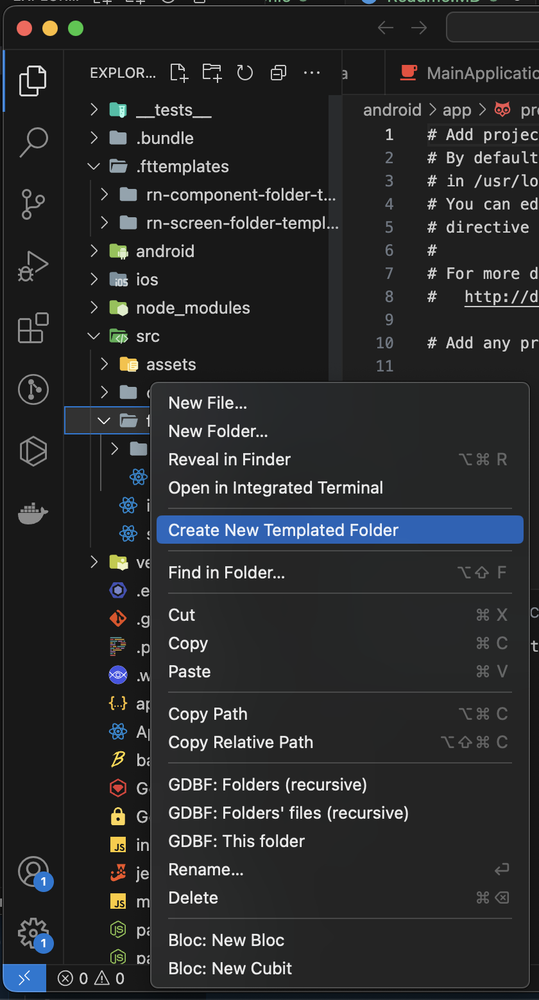
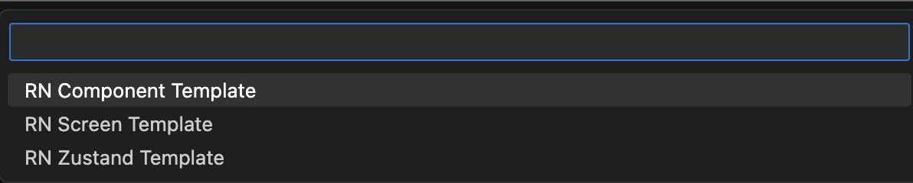
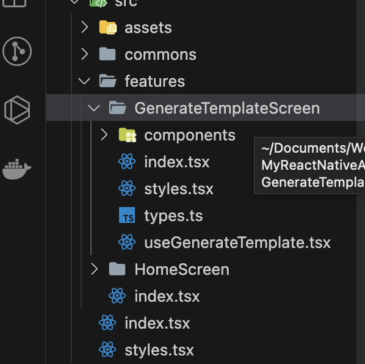

HOW TO USE THIS : 
1. Install vscode extension [folder templates](https://marketplace.visualstudio.com/items?itemName=Huuums.vscode-fast-folder-structure) 

2. Choose which programming language folder template you want

3. Copy folder **.fttemplates** to the root your of project 

4. then right click on the folder that you want to generate template 

5. Select template, then fill name and enter

6. Voilaa  

